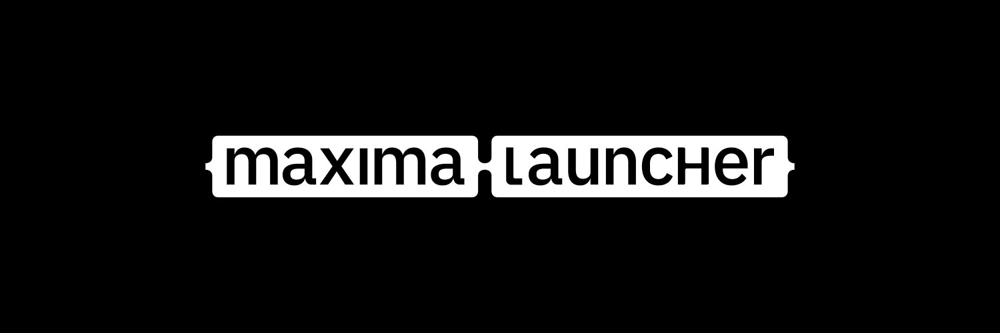

<p align="center">
  
</p>

<h1 align="center">Maxima-Draconis</h1>

<p align="center">
  EA authentication and launch backend for <a href="https://github.com/AA-EION/Draconis">Draconis</a> — Titanfall 2 on macOS via CrossOver / Wine.
</p>

<p align="center">
  
  
  
</p>

---

> [!WARNING]
> **Beta — primarily maintained for [Draconis](https://github.com/AA-EION/Draconis) on macOS/CrossOver.** TF2 reaches Main Menu reproducibly under the supported configuration (Steam install + Maxima CEG fix, OR Maxima-direct install). The code is still portable to the other OSes upstream supports (native Linux + Windows), but only the macOS/CrossOver path is actively tested. If you want vanilla Maxima on Linux or native Windows, **the [upstream repo](https://github.com/ArmchairDevelopers/Maxima) is a better fit.**

**Maxima-Draconis is an open-source replacement for the EA Desktop / Origin launcher.** It handles the EA authentication handshake and license resolution that EA-published games (specifically: Titanfall 2) require at startup. On macOS, it runs entirely **inside a CrossOver or Wine bottle** — it is a Windows application, not a native Mac app. The only Mac-native piece is `MaximaHelper.app`, a lightweight background agent that bridges EA's `qrc://` OAuth redirect from your browser into the bottle.

---

## How it fits into Draconis

```
macOS host
├── Draconis.app          ← native SwiftUI launcher
│   └── Resources/
│       └── MaximaHelper.app  ← bridges qrc:// OAuth from browser → Wine
│
└── CrossOver bottle
    ├── maxima-cli.exe        ← `serve` mode: long-running auth (LSX + /authorize)
    ├── maxima-bootstrap.exe  ← protocol handler shim (link2ea:// / origin2:// / qrc://)
    ├── maxima-service.exe    ← background Windows service (DLL injection, currently unused on Wine)
    └── Titanfall2.exe        ← the game itself, launched directly by Steam or Draconis
```

---

## Architecture (in one paragraph)

`maxima-cli serve` runs in the bottle as a long-lived auth provider. It owns two ports: **LSX on 3216** (what the game uses for auth) and **HTTP `/authorize` on 13219** (what `maxima-bootstrap` forwards to when a `link2ea://` or `origin2://` URL fires). Old EA-on-Steam games like Titanfall 2 emit `link2ea://` and **exit**, expecting whoever handles the URL to re-launch them with the EA auth context populated. Our flow: Steam/Draconis starts `Titanfall2.exe`, TF2 emits `link2ea://`, Wine routes to `maxima-bootstrap.exe`. Bootstrap probes `:13219`, forwards the offer ID to `/authorize`, and exits. The server (a) refreshes the OOA license `.dlf` on disk, (b) sets the EA-* env vars TF2 needs, and (c) spawns a fresh `Titanfall2.exe` with that environment via `launch::start_game` — the same code path the upstream UI's Play button uses. TF2 then connects to the LSX server, completes the handshake, and runs. If `serve` isn't running, bootstrap falls back to the legacy upstream behavior (spawn `maxima-cli launch <offer>` which does the full bootstrap from cold).

This split is in line with the design described in upstream issue [#27 "Support launching Maxima from Epic/Steam"](https://github.com/ArmchairDevelopers/Maxima/issues/27): a long-running auth server + a thin protocol-handler shim. There's a deeper writeup with sequence diagrams in [`CLAUDE.md`](./CLAUDE.md).

---

## What this fork adds over upstream

### macOS / CrossOver infrastructure

| Change | Detail |
|--------|--------|
| **`MaximaHelper.app`** | Native Swift background agent for macOS — replaces upstream's AppleScript helper. Properly bundle-signable so LaunchServices honors its `qrc://` URL handler claim. Universal arm64 + x86_64. |
| **NSIS installer** | `installer/maxima-setup.nsi` + cross-build via `mingw-w64` + `nsis` from macOS. Registers `link2ea://`, `origin2://`, `qrc://` in Wine's registry with proper backup/restore semantics; drops all five `.exe` binaries into the bottle's `Program Files\Maxima`. |
| **CI / release pipeline** | `.github/workflows/release.yml` — three-job tag-driven pipeline: macOS builds `MaximaHelper.app`, Windows builds `MaximaSetup.exe` and the loose binaries, Ubuntu assembles the GitHub release. Draconis pulls the assets automatically at build time. |
| **`.github/workflows/build-ci.yml`** | Three-OS push CI (Linux / Windows / macOS) keeping all three code paths honest. |
| **`.github/workflows/block-upstream-pr.yml`** | Guard against accidentally PR-ing fork-specific changes into upstream. |

### Code changes (could be sent upstream)

| Change | Detail |
|--------|--------|
| **`maxima-cli serve` mode** | Long-running auth-only subcommand. Starts LSX + the new `/authorize` HTTP server, optionally logs into RTM for friends presence, parks until Ctrl-C. Decouples authentication from game-spawning. |
| **`maxima-lib/src/auth_server.rs`** | New HTTP server: `GET /` (liveness probe) and `POST /authorize?offer_id=X[&cmd_params=…]` (license refresh + EA env var setup + game spawn via `launch::start_game`). Aligned with upstream issue #27's "long-running auth provider + thin protocol handler" design. Port 13219, overridable via `MAXIMA_AUTHORIZE_PORT`. |
| **Bootstrap: probe + forward** | `link2ea://` and `origin2://` handlers now probe the auth server before doing anything. If it's up, they forward via HTTP and exit. If it's down, they fall back to the upstream behavior (`maxima-cli launch <offer>`). Deduplicated into a single helper that handles both protocols. |
| **`Maxima::start_lsx` probe** | Before binding port 3216, checks if anyone else is listening. If yes, defers to them. Prevents the bootstrap-spawned `maxima-cli launch` from racing the existing `serve` for the LSX socket under Wine. |
| **Defensive LSX handlers** | `handle_license_request`, `handle_set_presence_request` no longer panic when `maxima.playing()` is None (i.e. game launched externally, not via Maxima). Returns sensible defaults so TF2's polling reconnects gracefully. Extension of `catornot/Maxima@patch-external-lsx` to the license path. |
| **Steam App ID support** | `STEAM_GAMES` table (currently TF2-only) + `resolve_steam_install_path` (registry + `libraryfolders.vdf` parser). Lets `maxima-cli launch 1237970` work for Steam-only owners whose EA account isn't linked. |
| **Real game version in `GetAllGameInfo`** | Captures `Version` from the LSX Challenge handshake and echoes it in `GetAllGameInfoResponse.InstalledVersion` / `AvailableVersion` (was hardcoded `1.0.1.3`). |
| **Bootstrap protocol-handler hardening** | All three protocols (`link2ea://`, `origin2://`, `qrc://`) now validate input shapes and defend against CLI flag injection (`--login=stolen_token` etc.). `origin2://` reads real `offerIds` from the URL instead of upstream's hardcoded Battlefront 2 offer. |
| **`maxima-cli` visibility under bootstrap** | `AllocConsole()` + `SetStdHandle("CONOUT$" / "CONIN$")` so the CLI is actually readable when bootstrap (GUI subsystem) spawns it. Panic hook to a dedicated log file. |
| **Persistent file logger** | Every binary mirrors its log to `%LOCALAPPDATA%\Maxima\Logs\<binary>.log` in addition to stdout. Each session writes a `===== maxima log session opened (pid=...) =====` header. Overridable via `MAXIMA_LOG_FILE`. |
| **Wine registry parity** | Added bare `HKLM\Software\Origin` registry entry that some EA titles check; `regedit` runs silently (`/S`); stderr captured. |
| **DLL injector wide-strings** | `GetModuleHandleA` / `LoadLibraryA` → `GetModuleHandleW` / `LoadLibraryW`. Handles non-ASCII install paths. From upstream `fix/non-ascii-characters`. |
| **License env override** | `MAXIMA_DENUVO_TOKEN` short-circuits the LSX `RequestLicense` handler and returns the token directly. Useful for offline debugging. From upstream `feat/license-token-override`. |
| **License-update parity** | `OnlineOffline` mode now calls `needs_license_update()` before re-requesting, matching `Online` mode. From upstream `fix/license-update-online-offline`. |
| **Offline mode** | `LaunchMode::Offline` implemented (was `todo!()` upstream). Looks up the offer from the library and sets `EALaunchOfflineMode=true`. Not yet exposed in Draconis UI. |

### Removed

- The original AppleScript-based macOS helper. Replaced by `MaximaHelper.app`.

---

## Quickstart (manual — Draconis automates this)

> If you're using Draconis v0.4.0+, you don't need to run any of this manually. Draconis downloads `MaximaSetup.exe` and `MaximaHelper.zip` from the latest release of this repo and installs them automatically.

**Prerequisites (macOS):** Xcode Command Line Tools (`xcode-select --install`), `brew install mingw-w64 nsis`, Rust nightly with the Windows GNU target (`rustup target add --toolchain nightly x86_64-pc-windows-gnu`).

```bash
# 1. Build MaximaHelper.app (host-side qrc:// bridge)
bash MaximaHelper/build.sh

# 2. Cross-compile MaximaSetup.exe (mingw-w64 + nsis)
bash installer/build.sh
# → installer/MaximaSetup.exe

# 3. Run MaximaSetup.exe inside your CrossOver bottle.
#    It drops maxima-cli, maxima-bootstrap, maxima-service, maxima.exe (UI),
#    maxima-tui.exe (TUI), and registers the protocol handlers in Wine's registry.

# 4. Inside the bottle, run maxima-cli once interactively to do OAuth login.
#    This stores a refresh token so subsequent `serve` runs are non-interactive.
maxima-cli.exe
# → Login Game (any) → browser opens → log in → MaximaHelper forwards
#   the redirect back into the bottle → token saved.
```

---

## How to run it

Once setup is done, the recommended flow for Draconis / TF2 is:

```bash
# Terminal 1 — leave this running:
maxima-cli.exe serve
# Look for:
#   LSX server listening on port 3216
#   Authorize HTTP server listening on 127.0.0.1:13219
#   Serving LSX. Launch your game externally; press Ctrl-C to stop.

# Then launch the game any way you like:
#   - Draconis → Play (vanilla or Northstar)
#   - Steam → Library → Titanfall 2 → Play
#   - cxstart --bottle "Titanfall 2" -- "C:\\…\\Titanfall2.exe"
```

When TF2 emits `link2ea://`, bootstrap probes the auth server, forwards the offer ID, exits. `serve` refreshes the `.dlf` license. TF2's polling loop reconnects to `serve`'s LSX and completes the auth handshake.

**Fallback (no `serve` running):** `maxima-cli.exe launch Origin.OFR.50.0001456` or `maxima-cli.exe launch 1237970` (Steam App ID — uses the `STEAM_GAMES` table) does the orchestrated upstream-style launch. This is what bootstrap auto-spawns when `/authorize` doesn't answer.

---

## Building from source

```bash
# Single binary (Windows cross-compile)
cargo +nightly build --release --target x86_64-pc-windows-gnu -p maxima-cli
cargo +nightly build --release --target x86_64-pc-windows-gnu -p maxima-bootstrap
cargo +nightly build --release --target x86_64-pc-windows-gnu -p maxima-service

# Full workspace (UI + TUI + lib + all)
cargo +nightly build --release --target x86_64-pc-windows-gnu

# macOS helper
bash MaximaHelper/build.sh

# Full installer (bundles all .exe files into MaximaSetup.exe)
bash installer/build.sh

# Fast cargo check during development
cargo check --target x86_64-pc-windows-gnu -p maxima-lib -p maxima-cli -p maxima-bootstrap
```

---

## Northstar online play

Northstar works with Maxima. The trick is using `NorthstarLauncher.exe -noOriginStartup` — that flag tells the Northstar binary to skip the hardcoded `Origin.exe` wait (Origin doesn't exist in Wine), which would otherwise hang forever. Draconis applies the flag automatically; the launch is wrapped in `maxima-cli launch titanfall-2 --game-path "...\NorthstarLauncher.exe" --game-args -noOriginStartup` so Maxima provides EA auth and Northstar's `wsock32.dll` proxy provides the engine hooks.

Vanilla TF2 with Northstar installed in the same bottle also goes through `NorthstarLauncher.exe`, just with the extra `--game-args -vanilla` flag to skip mod loading. Northstar's `wsock32.dll` proxy applies engine fixes even in vanilla mode, so there's no reason to bypass it.

Thanks to [catornot](https://github.com/catornot) for identifying the `-noOriginStartup` requirement and for contributing the external-LSX patch that makes online play work in this fork. See [catornot/flightcore-ng#wine_run.rs](https://github.com/catornot/flightcore-ng/blob/221e4444b6f1813c2401deed9f21d95494bad1ed/flightcore-ng-core/src/dev/wine/wine_run.rs#L23-L31) for reference.

---

## Status / known limitations

### What works

- **End-to-end TF2 launch on macOS/CrossOver via the CEG fix** (v0.11.0+). User reproducible: a Steam install of TF2 reaches Main Menu through the full LSX flow (`GetProfile` → `RequestLicense` → `GetAuthCode` → `QueryEntitlements` → `SetPresence`) after `maxima-cli install titanfall-2 --path "<steam_install>" --replace-files "Titanfall2.exe,Titanfall2_trial.exe" --only-listed-files` replaces just the two CEG-signed launcher binaries. ~3 MB download.
- **Headless install flow via `maxima.exe --install <slug> --install-path <abs>`** (v0.12.0+). Draconis spawns Maxima with these args; user logs into EA in their host browser; the UI auto-navigates to the Downloads view and downloads the game. `FInstall.txt` marker written to the install dir when `ContentManager` confirms `is_done()`.
- `maxima-cli serve` brings up LSX + the authorize HTTP server reliably inside the bottle.
- `maxima-bootstrap` correctly forwards `link2ea://` / `origin2://` to a running `serve` and falls back to spawning `maxima-cli launch` when nothing's listening.
- OAuth login (browser → `MaximaHelper.app` → `qrc://` → bottle) completes end-to-end.
- The `remid` cookie paste fallback works for browsers where `qrc://` is blocked.
- License preflight + `.dlf` write to `…/EA Services/License/` is exercised by every authorize call.
- Downloader retries transient Akamai failures with exponential backoff (v0.12.1+) instead of bailing on the first dropped connection.
- Cross-compiles and CI green on Linux + Windows + macOS.

### Known limitations

- **Steam-only TF2 owners**: If your TF2 EA license isn't linked to your EA account (Steam-only ownership), the EA library lookup fails and Maxima falls back to the `STEAM_GAMES` static table. For the cleanest experience, link your accounts at [ea.com](https://www.ea.com) — takes about 30 seconds and resolves the warning permanently.
- **Offline mode**: Implemented but not exposed in Draconis UI. License files live at `C:/ProgramData/Electronic Arts/EA Services/License/` and are valid for roughly two weeks.
- **`maxima-tui`**: Shipped in the installer but Draconis doesn't invoke it. `maxima-ui` (the graphical client) is now driven via `--install` for Draconis-orchestrated installs, but its standalone Login/Library/Play surface still hasn't been wired up to the `/authorize` HTTP endpoint — only `maxima-cli serve` provides it for now.
- **DLL injection on Wine**: `maxima-service`'s injector is Windows-only by design — Wine doesn't support `CreateRemoteThread` injection. The service is installed by NSIS but its injection path is never exercised in the Draconis flow.
- **`STEAM_GAMES` table is TF2-only**: Other EA-on-Steam titles would not resolve via the fallback. Extend `maxima-lib/src/steam.rs` per title you want to support.
- **Cloud saves, downloads, friends**: Implemented upstream and present in the codebase, but untested in the Draconis / CrossOver configuration.

For pending technical debt items, see ["Pending code quality items" in CLAUDE.md](./CLAUDE.md).

---

## Diagnostics

If something isn't working, check these in order:

```bash
# 1. Is MaximaHelper.app registered for qrc:// on the host?
swift -e 'import AppKit; let u = URL(string: "qrc://probe")!; \
  print(NSWorkspace.shared.urlForApplication(toOpen: u)?.path ?? "NONE")'

# 2. Is the helper bundle properly signed (not just linker-signed)?
codesign -dv /Applications/Draconis.app/Contents/Resources/MaximaHelper.app 2>&1 \
  | grep -E '(Identifier|Info.plist|Sealed Resources)'
# Want: Identifier=com.armchairdevelopers.maxima.helper, Info.plist=bound, Sealed Resources version=2

# 3. Inside the bottle: is serve listening on both ports?
nc -zv 127.0.0.1 3216    # LSX
nc -zv 127.0.0.1 13219   # Authorize HTTP

# 4. Did bootstrap actually run? Check %TEMP%/maxima_execution.log
#    (on CrossOver: ~/Library/Application Support/CrossOver/Bottles/<bottle>/drive_c/users/crossover/Temp/maxima_execution.log)
#    Look for "Forwarding link2ea offer=... to auth server" or "No auth server on...; falling back".

# 5. What did serve say? Check %LOCALAPPDATA%\Maxima\Logs\maxima-cli.log
#    Look for "Authorize request for offer '...'", "Refreshing OOA license for content_id=...", "New LSX connection: ...".
```

More detailed diagnostic recipes are in [`CLAUDE.md`](./CLAUDE.md#diagnostics).

---

## Project layout

```
maxima-lib/          Core library — auth, launch, license, library lookup,
                     LSX server, /authorize HTTP server, Steam helpers
maxima-cli/          CLI frontend — `serve` mode, `launch` mode, utilities
maxima-bootstrap/    Protocol handler shim — probe + forward, fallback spawn
maxima-service/      Background Windows service — registry setup, DLL injection
                     (Wine-incompatible, not exercised by Draconis)
maxima-tui/          Terminal UI (upstream, shipped but not invoked yet)
maxima-ui/           Graphical UI (upstream, shipped but not invoked yet)
maxima-resources/    Shared assets — logo, translations
MaximaHelper/        macOS Swift app — bridges qrc:// from host into the bottle
installer/           NSIS script + cross-build script (macOS → Windows .exe)
.github/workflows/   build-ci.yml, release.yml, block-upstream-pr.yml
```

---

## Upstream

This fork tracks [ArmchairDevelopers/Maxima](https://github.com/ArmchairDevelopers/Maxima) closely. Changes specific to Draconis / macOS / CrossOver stay in this fork; generic fixes get sent upstream when appropriate (and indeed, this fork has cherry-picked several already-merged or in-progress upstream branches — see ["Upstream branch survey" in CLAUDE.md](./CLAUDE.md)).

**Original Maxima creators:**
- [Sean Kahler](https://github.com/battledash) — creator of Maxima
- [Nick Whelan](https://github.com/headassbtw) — UI maintainer
- [Paweł Lidwin](https://github.com/imLinguin) — core maintainer

**This fork used by:** [AA-EION/Draconis](https://github.com/AA-EION/Draconis)

**Contributors to this fork:**
- [catornot](https://github.com/catornot) — `patch-external-lsx` upstream branch (the basis for our LSX-defensive handlers); `-noOriginStartup` flag documentation.

---

## License

GPL-3.0-or-later — same as upstream. See [LICENSE](./LICENSE).

## AI Disclosure

This project is developed with AI assistance. See **[AI.md](AI.md)** for how AI is used
here, the ethical obligations behind it, and how upstream credit and licensing are handled.
